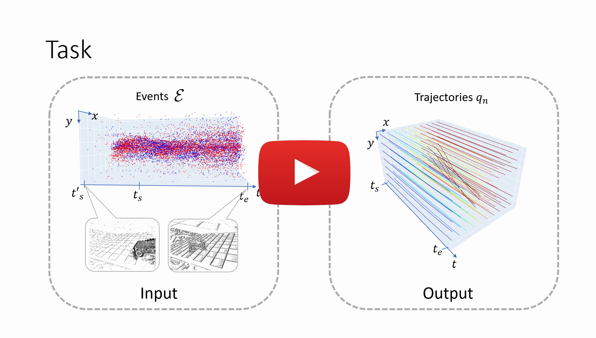

# MotionPriorCMax (ECCV 2024)

The official repository for [**Motion-prior Contrast Maximization for Dense Continuous-Time Motion Estimation**](https://arxiv.org/abs/2407.10802) accepted at **ECCV 2024** by [Friedhelm Hamann](https://friedhelmhamann.github.io/), [Ziyun Wang](https://ziyunclaudewang.github.io/), [Ioannis Asmanis](https://www.grasp.upenn.edu/people/ioannis-asmanis/), [Kenneth Chaney](https://scholar.google.com/citations?user=sIsVwNAAAAAJ&hl=en), [Guillermo Gallego](https://sites.google.com/view/guillermogallego), [Kostas Daniilidis](https://www.cis.upenn.edu/~kostas/).

<h2 align="left">

[Paper](https://arxiv.org/abs/2407.10802) | [Video (5min)](https://youtu.be/Pwnn3Xl9tSk) | [Talk (20min, NeuroPAC)](https://youtu.be/8b1FNsmsvNc) | [Data](https://drive.google.com/file/d/1YRlvjl0BiNxSQ-jZlw7QcebiBe7Zm2l9/view?usp=drive_link)

</h2>

[](https://youtu.be/Pwnn3Xl9tSk)

## Table of Contents

1. [Quickstart](#quickstart)
2. [Optical Flow](#optical-flow)
   - [Inference on DSEC](#inference-on-dsec)
   - [Training on DSEC](#training-on-dsec)
3. [Trajectory Prediction](#trajectory-prediction)
   - [Inference on EVIMO2](#inference-on-evimo2)
   - [Inference on MultiFlow](#inference-on-multiflow)
4. [Citation](#citation)
5. [Acknowledgements](#acknowledgements)
6. [Additional Resources](#additional-resources)

## Quickstart

Clone the repository and set up a conda environment for your project:

```bash
git clone https://github.com/tub-rip/MotionPriorCMax
conda create --name motionpriorcm python=3.10
conda activate motionpriorcm
```

Install PyTorch by choosing a command that matches your CUDA version. You can find the compatible commands on the [PyTorch official website](https://pytorch.org/get-started/locally/) (tested with PyTorch 2.2.2), e.g.:

```bash
conda install pytorch torchvision pytorch-cuda=12.1 -c pytorch -c nvidia
```

Install other required packages:

```bash
pip install -r requirements.txt
```

The training script has logging functionality based on wandb. If you want to use it, you can install it with:

```bash
pip install -U 'wandb>=0.12.10'
```

Otherwise, ignore this installation.

## Optical Flow

### Inference on DSEC

1. Download the test data from the official source and copy or link it to a folder called data:

```bash
cd <repository-root>
mkdir -p data/dsec/test && cd data/dsec/test
wget https://download.ifi.uzh.ch/rpg/DSEC/test_coarse/test_events.zip
unzip test_events.zip
rm test_events.zip
```

2. Download the model weights from [this Google Drive link](https://drive.google.com/file/d/1CPA4wXqZtLAc7o1haqWP-wZsM1dJHcX0/view?usp=sharing) and put them into a folder called `weights`. The resulting folder structure should be:

```
MotionPriorCmax
└── weights
    └── unet_dsec_ours-poly-k1_Tab4L7.pth
└── data
    └── dsec
        └── test
            ├── interlaken_00_a
            ├── interlaken_00_b
            └── ...
```

3. Run the inference script:

```bash
cd <repository-root>
python scripts/dsec_inference.py --config config/exe/dsec_inference/config.yaml
```

4. You'll find the predicted flow in `output/dsec_inference/YYYYMMDD_HHMMSS/flow`. To verify the results upload the zipped `flow` folder on the [DSEC benchmark page](https://dsec.ifi.uzh.ch/uzh/dsec-flow-optical-flow-benchmark/).

### Training on DSEC

1. For training, additionally download the training data:

```bash
cd <repository-root>
mkdir -p data/dsec/train && cd data/dsec/train
wget https://download.ifi.uzh.ch/rpg/DSEC/train_coarse/train_events.zip
unzip train_events.zip
rm train_events.zip
```

2. Run training on the DSEC dataset:

```bash
python scripts/flow_training.py --gpus 0 1 --config config/exe/flow_training/dsec.yaml
```

We trained on two A6000 GPUs, with a batch size of 14. For optimal results, you might need to adapt the learning rate when training with other setups.

To run your own model on the DSEC test set, select the corresponding checkpoint, extract the model weights using `scripts/extract_weights_from_checkpoint.py`, update the model path in the config and run the inference script as described.

## Trajectory Prediction

### Inference on EVIMO2

1. Download EVIMO2 from the official source. Detailed steps can be found [on the web page](https://better-flow.github.io/evimo/download_evimo_2.html). You can use their script to download the whole dataset. However, for the inference you'll only need the 8 validation sequences for the motion segmentation task. You can also download them manually.

2. Download the EVIMO2 continuous flow groundtruth data and copy them to the same folder structure as the event data.

3. Download the checkpoint file(s). [You find all checkpoints here](https://drive.google.com/drive/folders/1rIScxpsw13skVMW1RxqNxw3nWgVyyU6h?usp=drive_link). The checkpoints have the format `<model>_<dataset>_<exp-name>_<paper-ref>`. E.g. the model trained with our motion prior cmax loss on EVIMO2 is called `raft-spline_evimo2-300ms_ours-selfsup_Tab2L5.ckpt`. The resulting structure should look like this:

```
MotionPriorCmax
└── weights
    └── raft-spline_evimo2-300ms_ours-selfsup_Tab2L5.ckpt
└── data
    └── evimo2
        └── samsung_mono
            └── imo
                └── eval
                    ├── scene13_dyn_test_00_000000
                        ├── dataset_events_p.npy
                        ├── dataset_events_t.npy
                        ├── dataset_events_xy.npy
                        └── dataset_multiflow_10steps_vis.h5
                    └── ...
```

4. Now you can run inference for any of the models like this

```bash
python scripts/trajectory_inference.py \
    model=raft-spline \
    dataset=evimo2_300ms \
    +experiment=raft-spline_evimo2-300ms_ours-selfsup_Tab2L5 \
    hardware.gpus=0
```

Switch the experiment config according to the chosen checkpoint.

### Inference on MultiFlow

(Details to be added)

## Citation

If you use this work in your research, please consider citing:

```bibtex
@InProceedings{Hamann24eccv,
  author        = {Friedhelm Hamann, Ziyun Wang, Ioannis Asmanis, Kenneth Chaney, Guillermo Gallego, Kostas Daniilidis},
  title         = {Motion-prior Contrast Maximization for Dense Continuous-Time Motion Estimation},
  booktitle     = {European Conference on Computer Vision (ECCV)},
  doi           = {},
  year          = 2024
}
```

## Acknowledgements

Many of the low-level functions for contrast maximization are inspired by the implementation [Secrets of Event-based Optical Flow](https://github.com/tub-rip/event_based_optical_flow) and the implementation of the Bflow network was influenced by [BFlow](https://github.com/uzh-rpg/bflow). We thank the authors for their excellent work.

## Additional Resources

* [Recording Software (CoCapture)](https://github.com/tub-rip/CoCapture)
* [Homepage (TU Berlin, RIP lab)](https://sites.google.com/view/guillermogallego/research/event-based-vision)
* [Homepage (Science Of Intelligence)](https://www.scienceofintelligence.de/)
* [Event Camera Class at TU Berlin](https://sites.google.com/view/guillermogallego/teaching/event-based-robot-vision)
* [Survey paper](http://rpg.ifi.uzh.ch/docs/EventVisionSurvey.pdf)
* [List of Event Vision Resources](https://github.com/uzh-rpg/event-based_vision_resources)