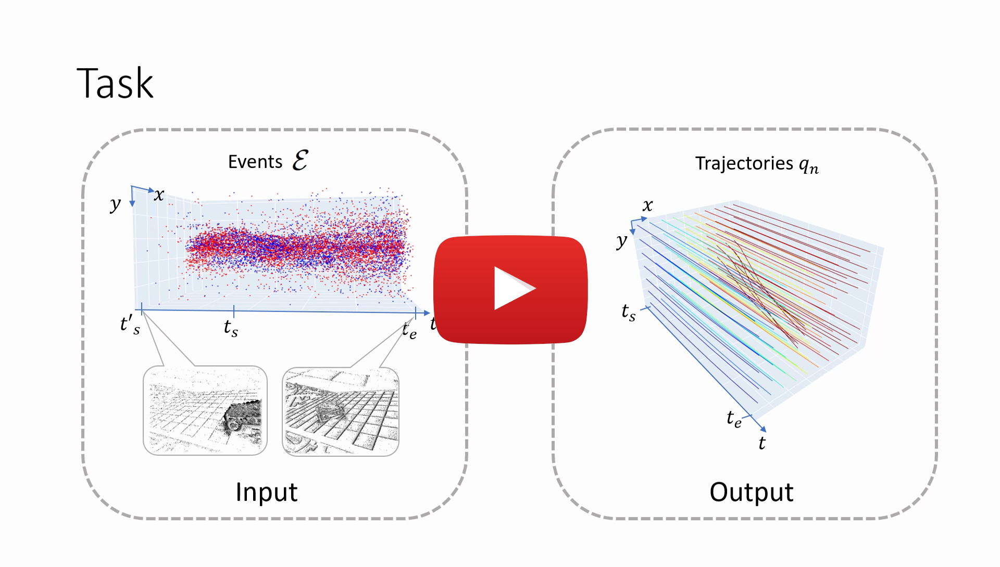

# MotionPriorCMax (ECCV 2024)
The official repository for [**Motion-prior Contrast Maximization for Dense Continuous-Time Motion Estimation**](https://arxiv.org/abs/2407.10802) accepted at **ECCV 2024** by [Friedhelm Hamann](https://friedhelmhamann.github.io/), [Ziyun Wang](https://ziyunclaudewang.github.io/), [Ioannis Asmanis](https://www.grasp.upenn.edu/people/ioannis-asmanis/), [Kenneth Chaney](https://scholar.google.com/citations?user=sIsVwNAAAAAJ&hl=en), [Guillermo Gallego](https://sites.google.com/view/guillermogallego),  [Kostas Daniilidis](https://www.cis.upenn.edu/~kostas/),

<h2 align="left">

[Paper](https://arxiv.org/abs/2407.10802) | [Video (5min)](https://youtu.be/Pwnn3Xl9tSk) | [Talk (20min, NeuroPAC)](https://youtu.be/8b1FNsmsvNc) | [Data](https://drive.google.com/file/d/1YRlvjl0BiNxSQ-jZlw7QcebiBe7Zm2l9/view?usp=drive_link)

</h2>

[](https://youtu.be/Pwnn3Xl9tSk)

## Citation

If you use this work in your research, please consider citing:

```bibtex
@InProceedings{Hamann24eccv,
  author        = {Friedhelm Hamann, Ziyun Wang, Ioannis Asmanis, Kenneth Chaney, Guillermo Gallego, Kostas Daniilidis},
  title         = {Motion-prior Contrast Maximization for Dense Continuous-Time Motion Estimation},
  booktitle     = {European Conference on Computer Vision (ECCV)},
  doi           = {},
  year          = 2024
}
```

## Additional Resources

* [Recording Software (CoCapture)](https://github.com/tub-rip/CoCapture)
* [Homepage (TU Berlin, RIP lab)](https://sites.google.com/view/guillermogallego/research/event-based-vision)
* [Homepage (Science Of Intelligence)](https://www.scienceofintelligence.de/)
* [Event Camera Class at TU Berlin](https://sites.google.com/view/guillermogallego/teaching/event-based-robot-vision)
* [Survey paper](http://rpg.ifi.uzh.ch/docs/EventVisionSurvey.pdf)
* [List of Event Vision Resources](https://github.com/uzh-rpg/event-based_vision_resources)
